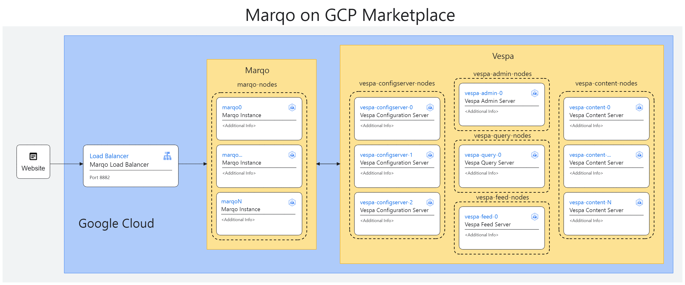

# Overview

Marqo redefines multimodal AI vector search by offering a powerful, all-in-one engine for both text and image processing, complete with inbuilt vector generation, storage, and retrieval based on tensor search.

It simplifies machine learning deployment and input transformations, ensuring seamless integration into your application. Embrace Marqo to elevate your AI and ML search capabilities with minimal effort and maximum efficiency.

For more information on Marqo, see the Marqo [official website](https://www.marqo.ai/).

## About Google Click to Deploy

Popular open stacks on Kubernetes, packaged by Google.

## Architecture



This solution uses Vespa as the vector repository. For more information visit [official documentation](https://docs.marqo.ai/).

# Installation

## Installing with Google Cloud Marketplace

Get up and running with a few clicks! To install this MarqoCloud app to a Google
Kubernetes Engine (GKE) cluster by using Google Cloud Marketplace, follow the
[on-screen instructions](https://console.cloud.google.com/marketplace/details/marqo-kubernetes).

## Command-line instructions

You can use [Google Cloud Shell](https://cloud.google.com/shell/) or a local
workstation to follow the steps below.

[](https://console.cloud.google.com/cloudshell/editor?cloudshell_git_repo=https://github.com/marqo-ai/marqo-on-GCP-marketplace&cloudshell_open_in_editor=README.md&cloudshell_working_dir=click-to-deploy/k8s/marqo)

### Prerequisites

#### Setting up command-line tools

You'll need the following tools in your development environment. If you are
using Cloud Shell, then `gcloud`, `kubectl`, Docker, and Git are installed in your
environment by default.

* [gcloud](https://cloud.google.com/sdk/gcloud/)
* [kubectl](https://kubernetes.io/docs/reference/kubectl/overview/)
* [helm](https://helm.sh/)

Login `gcloud` and follow the instructions:

```shell
gcloud auth login
```

Set the default project:

```shell
export PROJECT_ID=<PROJECT_ID>
gcloud config set project $PROJECT_ID
```

Set the app instance name:

```shell
export APP_INSTANCE_NAME=marqo1
```

Configure the container registery:

```shell
gcloud services enable containerregistry.googleapis.com
```

#### Creating a Google Kubernetes Engine (GKE) cluster

You will need to create a cluster, into which you will deploy the Marqo application.

Create a new cluster from the command line (this can take a few minutes):

```shell
# set cluster name
export CLUSTER=marqo-cluster

# set preferred zone and region
export REGION=australia-southeast1
export ZONE=australia-southeast1-a
gcloud config set compute/region $REGION
gcloud config set compute/zone $ZONE
```

Note: Ensure you have Kubernetes enabled in the project settings:
```shell
echo Open this URL:  https://console.developers.google.com/apis/api/container.googleapis.com/overview?project=$PROJECT_ID
```

Create the cluster:

```shell
gcloud container clusters create $CLUSTER
```

Configure `kubectl` to connect to the new cluster:

```shell
gcloud container clusters get-credentials "$CLUSTER"
```
#### Google Cloud Quota

Ensure you have enough quota to be able to provision the node pools below, the documentation for quotas in Google Kubernetes Engine can be [found here](https://cloud.google.com/kubernetes-engine/quotas). The same principle applies if you are seeking GPU-based Marqo instances, please refer to the [GPU documentation for Google Kubernetes Engine](https://cloud.google.com/kubernetes-engine/docs/concepts/gpus) for provisioning GPU enabled machine instances. You may seek to use the [reservation system](https://cloud.google.com/compute/docs/instances/reservations-overview) to ensure you have the quota required.

#### Create the GKE node pools

The Marqo system is composed of:

- Marqo
- Vespa

Each requires their own set of node-pools in order to function. Each of the various Marqo and Vespa containers will deploy into their own node-pool. Operating in seperate node-pools ensures fine control over each machine instance type.

Create the node pools (each can take a few minutes):

```shell
gcloud container node-pools create vespa-configserver-nodes --cluster "$CLUSTER" --machine-type n1-standard-2 --disk-type pd-standard --disk-size=20 --num-nodes 3

gcloud container node-pools create vespa-admin-nodes --cluster "$CLUSTER" --machine-type n1-standard-2 --disk-type pd-standard --disk-size=20 --num-nodes 1

gcloud container node-pools create vespa-feed-nodes --cluster "$CLUSTER" --machine-type n1-standard-2 --disk-type pd-standard --disk-size=20 --num-nodes 1

gcloud container node-pools create vespa-query-nodes --cluster "$CLUSTER" --machine-type n1-standard-2 --disk-type pd-standard --disk-size=20 --num-nodes 1

gcloud container node-pools create vespa-content-nodes --cluster "$CLUSTER" --machine-type n1-standard-2 --disk-type pd-standard --disk-size=20 --num-nodes 1

# Non-GPU enabled Marqo
# Alternatively, if you would like to make use of GPU-acceleration, uncommment and run the alternate command
gcloud container node-pools create marqo-nodes --cluster "$CLUSTER" --machine-type n2-standard-4 --disk-type pd-standard --disk-size=100 --num-nodes 1

# GPU enabled
# Uncommend and run this command in order to provision a GPU-accelerated machine instance type.
# gcloud container node-pools create marqo-nodes --accelerator type=nvidia-tesla-t4,count=1 --cluster "$CLUSTER" --machine-type n1-standard-2 --disk-type pd-standard --disk-size=100 --num-nodes 1
```

#### Delete the default node pool

Now we have the correct node pools configured, we can delete the `default-pool`

```shell
gcloud container node-pools delete default-pool --cluster "$CLUSTER" --quiet
```

### Installing

#### Install the application CRDs

```shell
kubectl apply -f "https://raw.githubusercontent.com/GoogleCloudPlatform/marketplace-k8s-app-tools/master/crd/app-crd.yaml"
```

# Deploy

Now the cluster is provisioned and configured it is possible to deploy from the GCP marketplace.
